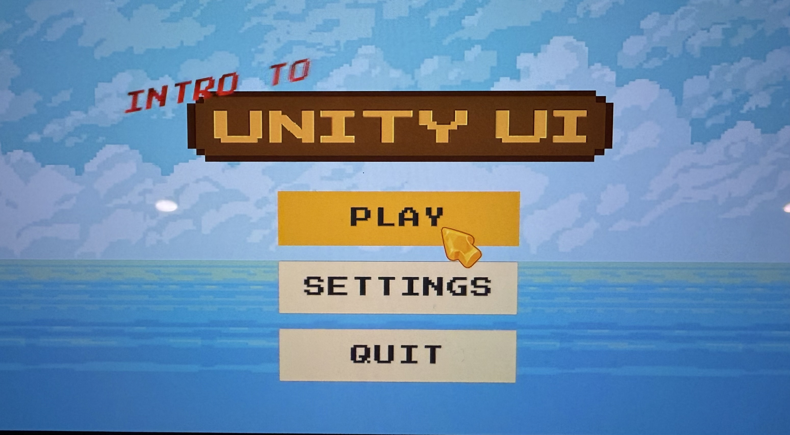
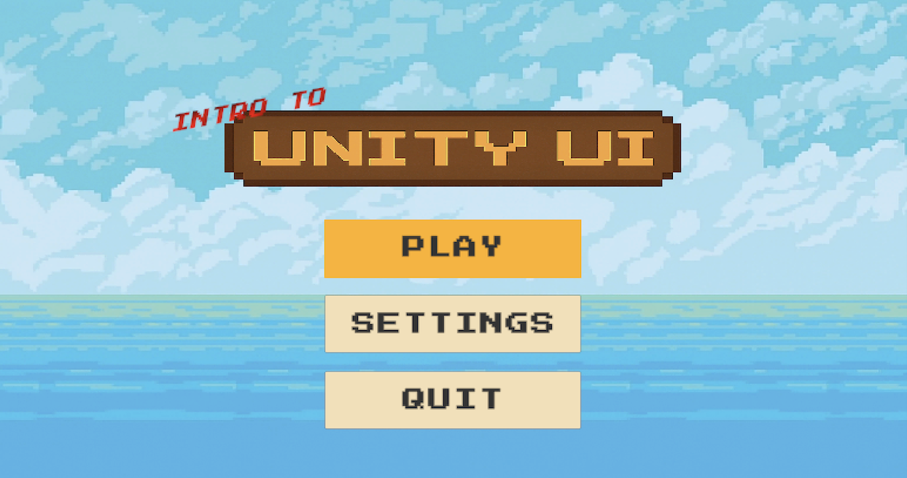

# Unity UI Assessment 🎮

## 📝 Overview
This project is a clean and functional main menu UI built in Unity 2D as part of a skills assessment. It demonstrates strong understanding of Unity UI framework, responsiveness, safe area awareness, and animation handling. The UI was assembled with careful attention to detail and layout consistency across devices and orientations.

## 🧩 UI Structure & Layout
- The menu consists of three main buttons: **Play**, **Settings**, and **Quit**.
- All UI elements are placed within a **Canvas** using a `Vertical Layout Group`, centered with consistent spacing.
- Anchors and pivots are set properly to ensure the layout **remains consistent in both portrait and landscape modes**.
- A **Safe Area** script was added at the Canvas level and adjusted manually to fit different screen devices, including those with notches or curved edges.
- UI components were tested under multiple resolutions to validate scalability.

## 🔧 Features
- 🎮 **Animated buttons** with hover scale using Unity's Animator
- 💤 **Idle animation** for the UI element in section 3 to simulate subtle motion
- 🧠 **Custom cursor interaction script** using `EventTrigger` to trigger animations and feedback
- 📝 **Custom font** (`PressStart2P-Regular`) manually downloaded and imported for a retro arcade look
- 🔲 Clean layout using groups, anchors, and spacing for consistency

## 💻 Scripts
A custom C# script was written to control UI button behavior:
- Listens for pointer events (`PointerEnter`, `PointerExit`)
- Triggers animation and visual feedback on hover
- Keeps the behavior modular and reusable across multiple UI buttons

## ⚠️ Challenges & Suggestions
- **Challenge:** When applying scale animations, button positions shifted due to layout recalculation.
- **Solution:** Used a nested GameObject for animations or applied `LayoutElement` + manual size override to avoid shifting.
- **Challenge:** Safe Area caused vertical misalignment with the layout group.
- **Solution:** Integrated the Safe Area at the Canvas level and manually resized the layout to stay within visible bounds.

## 🚀 How to Run
1. Clone or download this repository
2. Open the project in Unity Editor (`6000.1.11f1`)
3. Open `SampleScene`
4. Click **Play** to test the interface and animations

## ✅ How this meets the evaluation criteria:
- ✅ Demonstrated strong working knowledge of Unity UI system: Canvas, layout groups, anchors, pivots, and limitations.
- ✅ UI accurately recreated to match visual references, with attention to spacing, alignment, and visual behavior.
- ✅ Proactively identified layout issues caused by animation and proposed clean solutions.
- ✅ Completed within deadline, with clean and well-documented structure.

## Output Example
Here is a screenshot of the app output:

## 👩‍💻 Author
Fatmah Talal Merghelani
GitHub: [@FatmahMer](https://github.com/FatmahMer)
